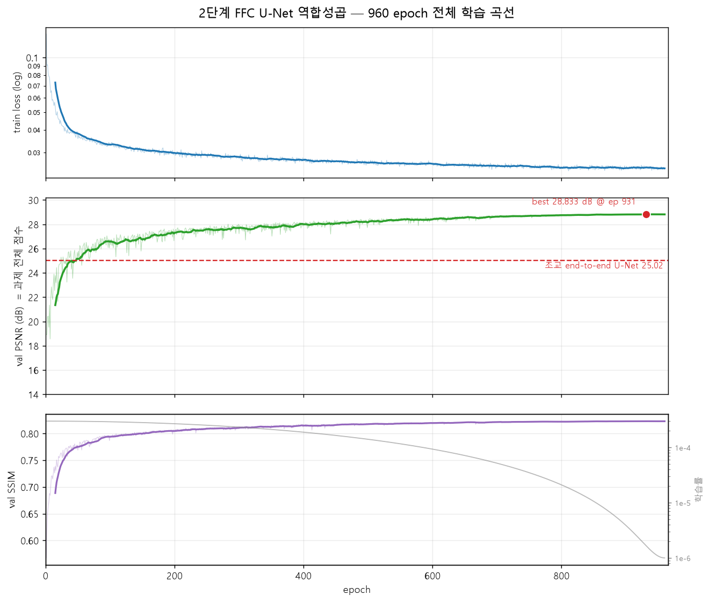
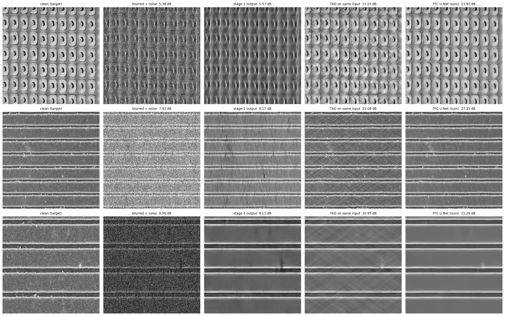

# FFC 2단계 복원 파이프라인 (jaehoon)

최종 과제(번짐 + 잡음이 섞인 영상에서 원본 영상을 복원)를 **두 단계로 나눠** 푼다.
두 단계 모두 FFC(Fast Fourier Convolution) 기반 U-Net 이고, 같은 구조를 쓴다.

```
번짐+잡음 영상 ──▶ [1단계: 잡음 제거] ──▶ 번진 영상 ──▶ [2단계: 역합성곱] ──▶ 원본 영상
   18.51 dB          train_denoise_ffc        30.27 dB       train_deconv_ffc        29.92 dB
```

FFC 는 채널을 둘로 나눠 절반은 보통의 3×3 합성곱(국소 갈래)으로, 절반은
FFT → 1×1 합성곱 → 역FFT(전역 갈래)로 처리하는 블록이다. 전역 갈래 덕분에
한 층이 영상 전체를 보므로, 번짐(다이폴 커널과의 합성곱)처럼 멀리 퍼지는
현상을 다루기에 알맞다.

## 최종 결과

**과제 전체 점수 (번짐+잡음 → 원본, 두 단계 통과):**

| 무엇 | PSNR | SSIM |
|---|---|---|
| **최종: 주최측 쌍 100장 + 뒤집기 앙상블** | **29.924 dB** | **0.8973** |
| 주최측 쌍, 앙상블 없이 | 29.465 dB | 0.8929 |
| 자체 합성 test 100장 (앙상블 없이) | 28.416 dB | 0.8835 |
| val (best ep931) | 28.833 dB | 0.8231 |
| 조교 end-to-end U-Net (비교 대상) | 25.02 dB | — |

**test 100장에서 같은 조건끼리 비교 (모두 같은 1단계 출력을 입력으로 받음):**

| 2단계 방법 | PSNR | SSIM |
|---|---|---|
| 아무것도 안 함 (1단계 출력 그대로) | 7.954 | 0.0524 |
| TKD (고전, 참고용) | 24.332 | 0.7586 |
| Wiener (금지 — 참고용) | 23.913 | 0.7403 |
| **FFC U-Net (우리 2단계)** | **28.416** | **0.8835** |
| TKD, 잡음 없는 번진 영상 입력 (상한 참고) | 34.689 | 0.9605 |





## 결과 해석

1. **조교 end-to-end U-Net 을 +4.90 dB 이겼다** (오차 기준 약 −43%). 학습 시작
   22분 만인 epoch 24 에 25.02 를 추월했다.
2. **학습형 2단계가 고전 방법을 크게 이긴다.** 같은 입력을 받은 TKD 보다
   +4.08 dB. "두 단계로 나누고 뒷단도 신경망으로" 라는 설계가 맞았는지는
   논쟁이 있었는데, 이 수치가 측정으로 답했다.
3. **남은 병목은 1단계 잔차다.** 잡음이 전혀 없는 번진 영상을 주면 고전
   TKD 조차 34.7 dB 가 나온다. 즉 2단계 위로 6 dB 이상의 여유가 있고, 그
   차이는 1단계가 못 지운 잡음(특히 rician)이 역합성곱에서 증폭된 대가다.
   다음에 손댈 곳은 2단계가 아니라 1단계 rician 이다.
4. **물리 정보 주입이 결정적이었다.** 방향 고정 + 다이폴 지도 주입 전(v1)에는
   epoch 20 에 17.68 dB 였고, 주입 후(v2) 같은 지점에서 24.48 dB 다 (+6.8 dB).
   구조 반복 학습이 아니라 문제의 물리를 신경망에 알려준 효과다.

## 무학습 부스터 (노트북 마지막 3개 셀)

학습 없이 추론만 바꾸는 후보들을 val 에서 겨루고, 1등만 주최측 쌍에 적용했다.

| 후보 | val 변화 | 판정 |
|---|---|---|
| **뒤집기 4배 앙상블** | **+0.37** (공식 쌍에서는 +0.46) | **채택** |
| 데이터 일관성 (hard/soft, t·K 전 구간) | −0.01 ~ −6.95 | 기각 |
| multi-K 최소제곱 융합 | +0.36 (앙상블 단독보다 낮음) | 기각 |
| best+last 체크포인트 앙상블 | −0.00 | 기각 |

- 뒤집기 앙상블은 다이폴(B0=(0,1))과 정확히 교환 가능한 좌우/상하/180도 변환만
  쓴다 (90도 회전은 교환이 안 되므로 금지 — 수치로 검증).
- 데이터 일관성이 전 구간 마이너스라는 것은, 다이폴 지도를 입력받은 신경망이
  안정 주파수 대역에서조차 측정의 직접 역산보다 이미 낫다는 뜻이다. multi-K
  융합의 가중치도 신경망 +0.984 로 수렴해 같은 결론을 준다. **학습 중 물리
  주입이 사후 물리 보정을 이겼다.**
- best(ep931)/last(ep960) 앙상블이 무효인 이유: 코사인 감쇠 끝이라 두 시점의
  가중치가 거의 같아, 서로 다른 실수가 없어 평균해도 상쇄될 것이 없다.

## 파일

| 파일 | 내용 |
|---|---|
| `train_denoise_ffc.ipynb` | **1단계.** 번짐+잡음 영상에서 잡음만 지워 번진 영상을 만든다 |
| `train_deconv_ffc.ipynb` | **2단계.** 번진 영상에서 번짐을 되돌려 원본 영상을 만든다. 1단계 체크포인트를 불러 쓴다 |
| `history_deconv.png` | 2단계 960 epoch 학습 곡선 |
| `ffc_grid.png` | test 표본의 정성 비교 (원본 / 입력 / 1단계 출력 / TKD / 우리 결과) |
| `a100_denoising.py`, `train_denoising_a100.ipynb` | junsung 님 DnCNN 미세조정 코드 (main 에서 병합됨) |
| `checkpoint_best_a100*.ckpt` | DnCNN 체크포인트 |

## 1단계 — train_denoise_ffc.ipynb

- **학습 쌍 만들기**: 깨끗한 학습 영상을 다이폴 커널로 번지게 한 뒤(6개 방향 중
  무작위) 잡음을 섞는다. 입력 = 번진 영상 + 잡음, 정답 = 번진 영상.
- **잡음 4종**: gaussian, rician, uniform, salt_and_pepper. 세기는 종류별 범위에서
  무작위. rician 이 유독 약해서 학습에서 40% 비중으로 더 자주 뽑는다.
- **손실**: L1 + 국소 평균 항(8/16/32 창의 평균끼리 L1). rician 잡음은 밝기를
  위로 미는 편향(+0.029)이 있는데 L1 만으로는 이 편향을 못 잡아서 넣었다.
- **전역 skip**: 입력과 출력이 거의 같은 문제라 `출력 = 신경망(입력) + 입력` 꼴을 쓴다.

test 100장 종류별 성적 (200 epoch 학습 완료):

| 잡음 | 입력 | FFC U-Net | Mean 3×3 | Median 3×3 |
|---|---|---|---|---|
| gaussian | 19.953 | **31.029** | 22.801 | 22.627 |
| rician | 14.557 | **23.229** | 17.024 | 16.900 |
| uniform | 22.295 | **31.610** | 23.499 | 22.445 |
| salt_and_pepper | 17.223 | **35.198** | 22.359 | 26.698 |
| 전체 | 18.507 | **30.266** | 21.421 | 22.167 |

남은 약점: rician (전체 제곱오차의 72.7%를 혼자 차지). rician 을 나머지 수준까지
올리면 1단계가 +2.3 dB, 최종 점수도 그 절반쯤 따라 오른다.

## 2단계 — train_deconv_ffc.ipynb

핵심 설계 세 가지:

1. **학습 입력 = 얼린 1단계의 실제 출력** (`STAGE1_MODE = "frozen"`).
   시험 때 2단계가 받는 것은 1단계 출력이므로 학습 입력도 같은 분포여야 한다.
   역합성곱은 입력 분포의 어긋남을 최대 44,074배까지 증폭하기 때문에 중요하다.
2. **다이폴 지도 주입** (`USE_DIPOLE_FEATURE = True`). FFC 전역 갈래의 1×1
   합성곱은 모든 주파수에 같은 가중치를 써서, 주파수마다 다른 이득 1/D(k)를
   표현할 수 없다. 각 주파수 자리의 D, log|D|, sign(D) 세 채널을 함께 넣어
   이 한계를 풀었다. 조교 공지의 "물리 기반 모델에 다이폴 모델 사용 가능"에 해당.
3. **방향 고정** (`FIX_ORIENTATION = True`). 시험은 B0 = (0, 1) 한 방향이므로
   학습도 그 방향만 쓴다. 6개 방향에 용량을 흩지 않는다.
   ※ 최종 시험이 정말 한 방향인지는 조교 확인이 필요하다. 여러 방향이면
   이 스위치를 꺼야 한다.

보조 장치:

- **물리 항**: 손실에 `0.1 × |dipole(복원 결과) − 깨끗한 번진 영상|` 추가.
- **발산 감지기**: loss 가 직전의 5배를 넘으면 best 체크포인트로 되돌리고
  학습률을 절반으로 줄여 계속 간다. (960 epoch 동안 한 번도 발동 안 함.)
- **EPOCH_FRACTION = 4**: 한 epoch 에 학습 영상의 1/4만 무작위로 쓴다. 총
  계산량은 같지만 epoch 수가 늘어 코사인 학습률 곡선이 끝까지 내려간다.
- **이어받기**: 로컬과 Drive 체크포인트 중 저장된 epoch 이 큰 쪽을 자동 선택.
  실제로 학습 중 연결이 두 번 끊겼지만 기록 손실 없이 이어서 완주했다.
- `STAGE1_MODE = "e2e"` 로 바꾸면 1단계 없이 한 모델이 번짐+잡음 → 원본을
  통째로 배우는 대조 실험이 된다 (조교 U-Net 과 같은 구도).

## 실행 방법 (Colab)

1. Drive 의 `MyDrive/project5/` 에 `dataset.zip` 을 둔다 (2단계는 이것만 필요).
2. `train_denoise_ffc.ipynb` 를 먼저 끝낸다 → `logs_denoise_ffc_blur/checkpoint_best.ckpt`
   가 Drive 에 생긴다.
3. **새 런타임에서** `train_deconv_ffc.ipynb` 를 위에서부터 실행한다.
   (1단계 체크포인트가 없으면 2단계는 시작하지 못하고 명확한 오류를 낸다.)
4. 체크포인트는 매 epoch 로컬에, 30 epoch 마다 Drive 에 저장된다. 끊겨도
   노트북을 다시 실행하면 이어서 학습한다.

## 규칙 관련 주의

- **Wiener 필터는 최종 제출에 사용 금지.** 노트북 안의 TKD/Wiener 코드는
  파이프라인 부품이 아니라 참고용 계기판이다 (우리 결과와 나란히 찍어
  고전 방법 대비 위치를 보는 용도).
- **test set 은 점수 확인 외 사용 금지.** 모든 관찰·튜닝은 val 에서 한다.
- 지도학습(제공된 깨끗한 영상 사용)은 명시적으로 허용됨.
- 위 test 표의 손상은 노트북이 test_label 에서 재합성한 것이다. 주최측이
  직접 만들어 제공한 쌍(`test_deconv_noise` → `test_label`)으로 재는 셀을
  따로 돌리면 공식 조건의 숫자가 나온다 (거의 같을 것으로 예상).
